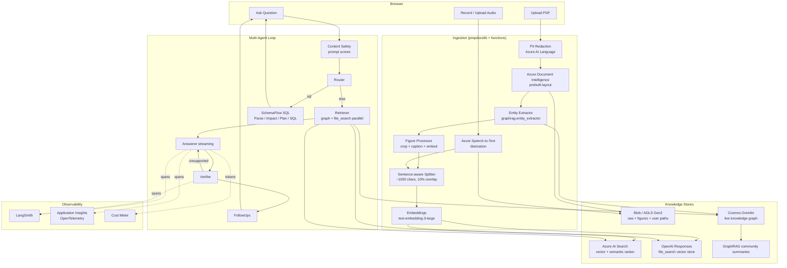
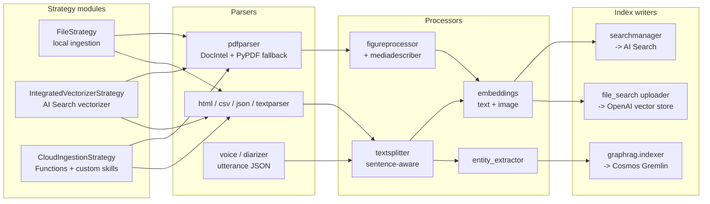
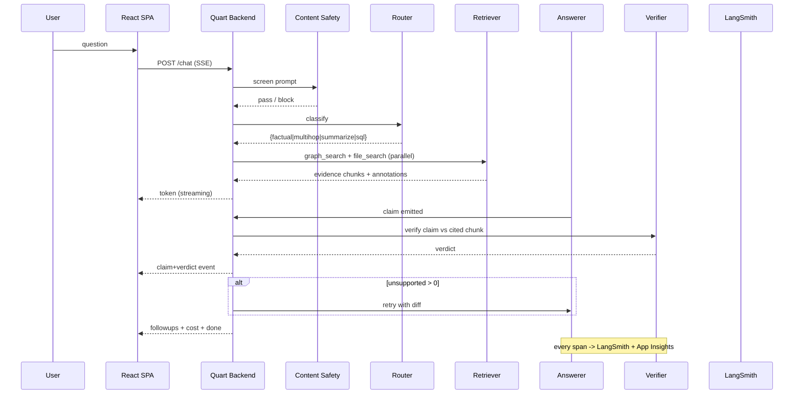

# multimodal_rag_application

Multimodal Retrieval-Augmented Generation system with PDF + voice ingestion, GraphRAG, a multi-agent QA loop gated by a Verifier, citation-grade evidence, SchemaFlow-style SQL agent, and full LangSmith + Azure Monitor tracing. Paired with a Jekyll portfolio site under `site/`.

For Claude Code operating instructions, see [CLAUDE.md](CLAUDE.md).

---

## Project Overview

This project demonstrates an end-to-end production pattern for grounded conversational AI over private multimodal corpora. It combines Azure Document Intelligence and Azure Speech-to-Text for ingestion, GraphRAG and Azure AI Search for retrieval, the OpenAI Responses API `file_search` tool for citation-grade evidence, and a four-agent loop (Router -> Retriever -> Answerer -> Verifier) for answer generation. A separate SchemaFlow multi-agent planner demonstrates SQL literacy over a sample TCGA-like clinical warehouse. LangSmith and Azure Monitor instrument every span.

The pipeline transitions from **Natural Language Space** (PDFs and recordings) to **Code Entity Space** (graph nodes, vector chunks, citation annotations, verifier verdicts, cost meters).

---

## Use Case Context

Knowledge workers (clinicians, researchers, analysts) consume long PDFs and recorded discussions and need verifiable answers traceable to a page or utterance. The primary safety endpoint is the **Unsupported-Claim Rate**: the proportion of generated sentences the Verifier cannot ground in retrieved evidence. The system targets < 2% on the golden eval set, refusing rather than fabricating on the remaining sentences.

| Demo | Inputs | Knowledge artifact | Question type |
|---|---|---|---|
| Scientific Paper Summarizer | PDFs | Paper / Section / Figure / Author / Citation graph | factual, multi-hop, summarization |
| Voice Transcription Service | Mic + uploaded audio | Recording / Utterance / Speaker / Topic graph | factual, summarization, attribution |
| QA Chatbot | Mixed corpus | Unified graph + dual vector stores | any of the above |
| SchemaFlow SQL Demo | NL change request | Typed Parse / Impact / Plan / SQL artifacts | SQL change planning |

---

## Pipeline Architecture

### System Data Flow



### Extraction Logic Entity Mapping



### Multi-Agent QA Flow



---

## Repository Structure and Setup

The repo is a monorepo containing the Jekyll portfolio, the Quart + React demo app, the Bicep infrastructure, the eval harness, and a devcontainer. See [CLAUDE.md](CLAUDE.md) section 3 for the full annotated tree.

### Quick start (Azure)
```bash
azd auth login
azd env new robertjames-mmrag
azd up
./scripts/prepdocs.sh
./app/start.sh
```

### Quick start (local-only, no Azure credentials)
```bash
export MODE=local
./app/start.sh
```
See [docs/localdev.md](docs/localdev.md). Uses Ollama, faster-whisper, FAISS, SQLite.

### DevContainer
Open in VS Code -> "Reopen in Container" -> wait ~5 minutes. Both Azure and local modes work inside.

---

## Selected Projects on ML and AI

### LLM Clinical Feature Extraction - Validation, Safety Evaluation, and Optimization
- [Wiki](https://github.com/Robertjam954/llm-clinical-extraction/wiki)
- [Visualizations](https://robertjam954.github.io/llm-clinical-extraction/viz)

### The Nonlinear Effects of Mutation on Site-Specific Metastasis and Survival
- [Wiki](https://github.com/Robertjam954/mutation-metastasis-survival/wiki)
- [Visualizations](https://robertjam954.github.io/mutation-metastasis-survival/viz)

---

## Key Project Links

| Topic | Description |
|---|---|
| Data Ingestion | DocIntel + Speech-to-Text + sentence-aware chunking + embeddings ([docs/data_ingestion.md](docs/data_ingestion.md)) |
| GraphRAG | Cosmos Gremlin live graph + community summaries + drift search ([docs/graphrag.md](docs/graphrag.md)) |
| Multi-Agent Chat | Router / Retriever / Answerer / Verifier loop with streaming ([docs/verifier.md](docs/verifier.md)) |
| Agentic Retrieval | Optional Azure AI Search Knowledge Agent ([docs/agentic_retrieval.md](docs/agentic_retrieval.md)) |
| SchemaFlow SQL | Parse / Impact / Plan / SQL multi-agent change planner ([docs/sql_schemaflow.md](docs/sql_schemaflow.md)) |
| Citations | OpenAI Responses API file_search annotations with PDF + audio deep-linking ([docs/citations.md](docs/citations.md)) |
| Voice | Real-time STT + diarization + audio timestamp sync ([docs/voice.md](docs/voice.md)) |
| Safety | Azure AI Content Safety + PII redaction ([docs/productionizing.md](docs/productionizing.md)) |
| Tracing | LangSmith + Azure Monitor OpenTelemetry ([docs/tracing.md](docs/tracing.md), [docs/monitoring.md](docs/monitoring.md)) |
| Evaluation | Promptfoo + ai-rag-chat-evaluator + Verifier eval ([docs/evaluation.md](docs/evaluation.md)) |
| Safety Evaluation | Azure AI Foundry adversarial simulator ([docs/safety_evaluation.md](docs/safety_evaluation.md)) |

---

## Blog

Jekyll posts under `site/_posts/`. RSS at `/feed.xml`, sitemap at `/sitemap.xml`.

---

## License

MIT. See [LICENSE](LICENSE).
