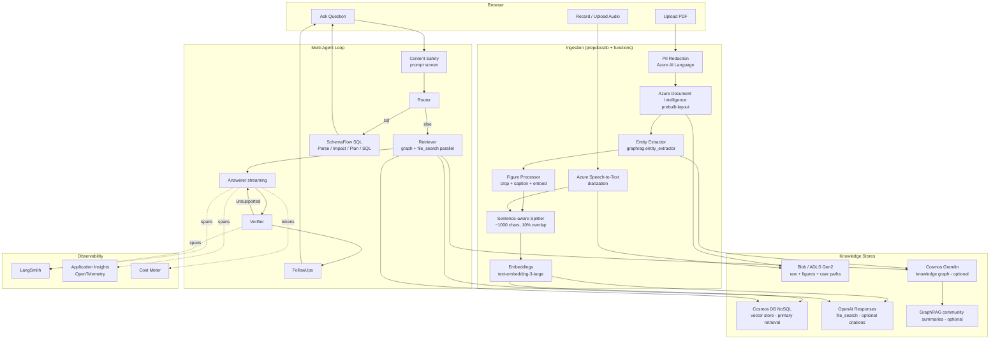
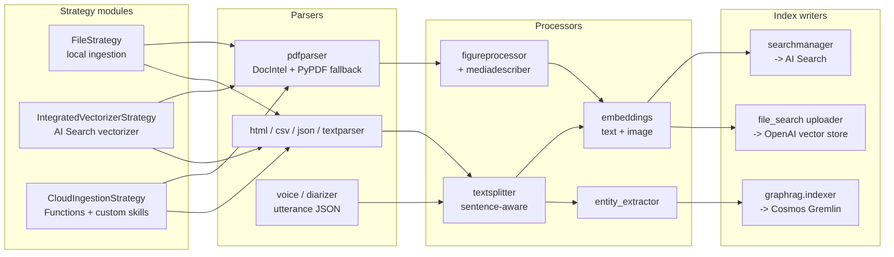
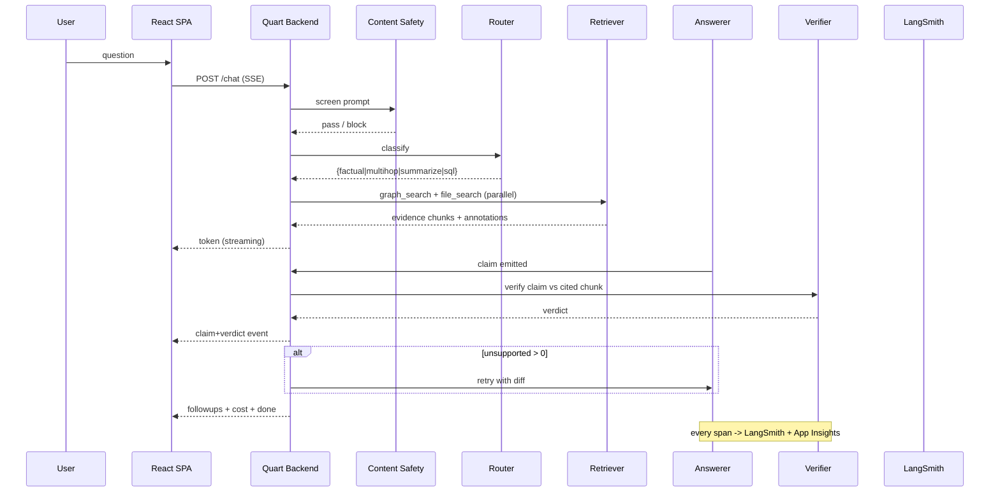

# multimodal_rag_application

Multimodal Retrieval-Augmented Generation system with PDF + voice ingestion, an optional GraphRAG layer, a multi-agent QA loop gated by a Verifier, citation-grade evidence, a SchemaFlow-style SQL agent, and LangSmith + Azure Monitor tracing. Paired with a static portfolio site under `site/`.

For Claude Code operating instructions, see [CLAUDE.md](CLAUDE.md).

---

## Project Overview

This project demonstrates an end-to-end pattern for grounded conversational AI over private multimodal corpora. The chat path is a LangGraph multi-agent loop (Router -> Retriever -> Answerer -> Verifier -> FollowUps) that streams tokens over Server-Sent Events while the Verifier grounds each claim against retrieved evidence. Retrieval is served by a pluggable document retriever; the deployed configuration uses an **Azure Cosmos DB (NoSQL) vector store**, and the default local configuration uses a Redis-backed notes store. Optional layers - GraphRAG (Cosmos Gremlin), OpenAI Responses `file_search` citations, Azure Document Intelligence ingestion, Azure Speech voice, content safety, and PII redaction - exist in the code and are toggled by feature flags. A separate SchemaFlow multi-agent planner demonstrates SQL change planning. LangSmith and Azure Monitor (OpenTelemetry) instrument the spans.

> **Code vs. deployment.** The backend implements a broad feature set behind `USE_*` flags. The current Azure deployment enables a focused subset (Cosmos vector retrieval + Verifier + chat history). Optional integrations that are not wired into the deployed infra (Azure AI Search, GraphRAG, voice, content safety, PII, Redis, PostgreSQL) fall back to stubs or are turned off. See [Deployed configuration](#deployed-configuration) below.

The pipeline transitions from **Natural Language Space** (PDFs and recordings) to **Code Entity Space** (graph nodes, vector chunks, citation annotations, verifier verdicts, cost meters).

---

## Use Case Context

Knowledge workers (clinicians, researchers, analysts) consume long PDFs and recorded discussions and need verifiable answers traceable to a page or utterance. The primary safety endpoint is the **Unsupported-Claim Rate**: the proportion of generated sentences the Verifier cannot ground in retrieved evidence. The system targets < 2% on the golden eval set, refusing rather than fabricating on the remaining sentences.

| Demo | Inputs | Knowledge artifact | Question type |
|---|---|---|---|
| Scientific Paper Summarizer | PDFs | Paper / Section / Figure / Author / Citation graph | factual, multi-hop, summarization |
| Voice Transcription Service | Mic + uploaded audio | Recording / Utterance / Speaker / Topic graph | factual, summarization, attribution |
| QA Chatbot | Mixed corpus | Unified graph + dual vector stores | any of the above |
| SchemaFlow SQL Demo | NL change request | Typed Parse / Impact / Plan / SQL artifacts | SQL change planning |

---

## Pipeline Architecture

### System Data Flow



### Extraction Logic Entity Mapping



### Multi-Agent QA Flow



---

## Repository Structure and Setup

The repo is a monorepo containing the static portfolio site (`site/`), the Quart + React demo app (`app/`), the Bicep infrastructure (`infra/`), scripts (`scripts/`), and the eval harness (`evals/`). See [CLAUDE.md](CLAUDE.md) for the full annotated tree.

### Quick start (Azure)

The deployment targets a pre-existing `ai-tutor` resource group (Foundry, Cosmos, Blob, Key Vault). `azd up` provisions only the missing compute/observability (Container Apps, ACR, Log Analytics, Application Insights) and wires the backend to those resources with keyless Entra ID auth.

```bash
azd auth login
azd env new robertjames-mmrag
azd up            # provisions compute + deploys the backend container
```

### Quick start (local dev)
```bash
# Option 1: Docker Compose (requires Docker)
docker-compose up
# Backend at http://localhost:50505
# Frontend at http://localhost:5173

# Option 2: Manual (requires Python 3.11 + Node 20)
./app/start.sh    # boots the Quart backend on :50505 and the Vite frontend on :5173
```

Local config is driven by `app/backend/.env` (git-ignored). By default the backend uses the Redis-backed notes retriever (`DOCUMENT_RETRIEVER=redis_notes`); the deployed container sets `DOCUMENT_RETRIEVER=cosmos`.

---

## Selected Projects on ML and AI

### LLM Clinical Feature Extraction - Validation, Safety Evaluation, and Optimization
- [Wiki](https://github.com/Robertjam954/llm-clinical-extraction/wiki)
- [Visualizations](https://robertjam954.github.io/llm-clinical-extraction/viz)

### The Nonlinear Effects of Mutation on Site-Specific Metastasis and Survival
- [Wiki](https://github.com/Robertjam954/mutation-metastasis-survival/wiki)
- [Visualizations](https://robertjam954.github.io/mutation-metastasis-survival/viz)

---

## Components

Where each capability lives in the code (subdirectories of `app/backend/`):

| Topic | Where |
|---|---|
| Multi-agent chat | `approaches/multiagent_approach.py`, `agents/{router,retriever,answerer,verifier,followups}.py` |
| Hierarchical agent teams (opt-in via `USE_HIERARCHICAL_AGENTS`) | `approaches/hierarchical_multiagent_approach.py`, `agents/hierarchical_graph.py` |
| Document retrieval (pluggable) | `core/document_retriever.py`, `core/cosmos_vector_retriever.py` (deployed), Redis notes retriever (local default) |
| GraphRAG (optional) | `graphrag/`, `agents/tools.py:graph_search` (stubs when no Cosmos Gremlin account) |
| Citations (optional) | `agents/tools.py:file_search` - OpenAI Responses `file_search` (stubs when no vector store id) |
| SchemaFlow SQL | `approaches/sql_schemaflow_approach.py`, `agents/sql_schemaflow.py` |
| Voice (optional) | `voice/` (Azure Speech / Voice Live bridge), routes `/voice/stream`, `/voice/clean` |
| Data ingestion | `prepdocs.py`, `prepdocslib/` |
| Safety (optional) | `safety/content_safety.py`, `safety/pii.py` |
| Tracing | `tracing/otel.py` (Azure Monitor), `tracing/langsmith.py` |
| Evaluation | `evals/` (see files under `evals/`) |

---

## Deployed configuration

`infra/main.bicep` is a Stage-1 deploy against the existing `ai-tutor` resource group. It creates Log Analytics, Application Insights, Azure Container Registry, a Container Apps environment, the backend Container App, and Entra ID role assignments. It references (does not recreate) the pre-existing Foundry account/project, Cosmos DB account, Blob storage, and Key Vault.

- **Chat + embeddings:** Azure AI Foundry project endpoint (`AZURE_AI_PROJECT_ENDPOINT`) for chat/Responses; the Foundry account endpoint for embeddings.
- **Retrieval:** Cosmos DB NoSQL vector store (`DOCUMENT_RETRIEVER=cosmos`, database `rag`, container `documents`).
- **Chat history:** Cosmos DB NoSQL (database `chat`, container `history`).
- **Auth:** keyless / Entra ID only. The Container App uses a system-assigned managed identity; `infra/app/rbac.bicep` grants Cognitive Services OpenAI User, Azure AI User, Cosmos DB Built-in Data Contributor, Storage Blob Data Contributor, Key Vault Secrets User, and AcrPull. No API keys.
- **Feature flags set by the deploy:** `USE_VERIFIER=true`, `USE_VECTOR_SEARCH=true`, `USE_FEEDBACK` from param, `USE_CHAT_HISTORY_COSMOS=true`. Turned off: `USE_GRAPHRAG`, `USE_MULTIMODAL`, `USE_VOICE_DEMO`, `USE_SQL_DEMO`, `USE_CONTENT_SAFETY`, `USE_PII_REDACTION`.

Note: several Bicep modules for optional services (Azure AI Search, Speech, Vision, Content Safety, Document Intelligence, Cosmos Gremlin) exist under `infra/core/` but are not currently composed into `main.bicep`.

---

## Portfolio site

`site/` is a self-contained static HTML page (`site/index.html`), deployed to GitHub Pages as-is (no Jekyll build) by `.github/workflows/pages.yml`.

---

## License

MIT. See [LICENSE](LICENSE).
